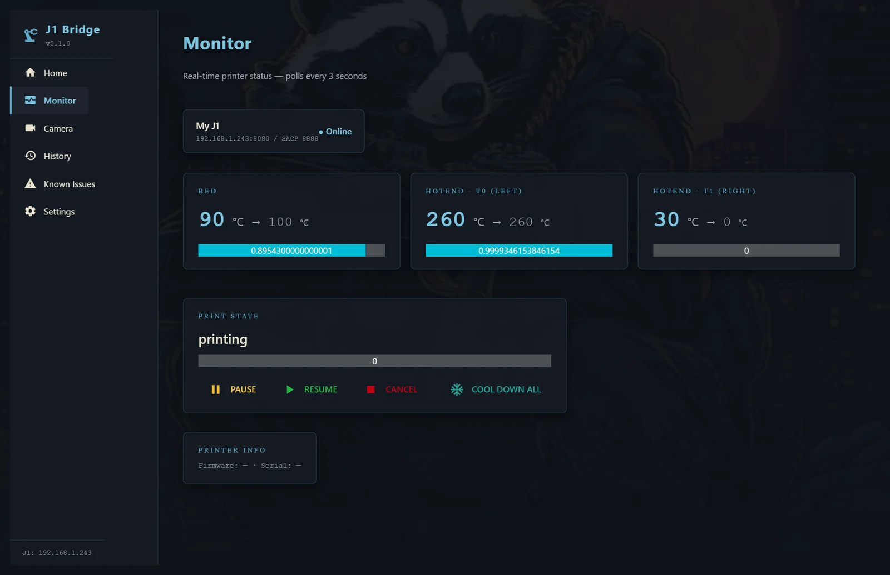

# HONEYBADGER SOFTWARE INC

### Small Windows tools that fix what the big vendors won't.

3D printers, machinery, dashboards — they all ship with workflow gaps.
We build the polished one-click installers that close them.

[-C9A961?style=for-the-badge)](#)

---

## 🚧 In active beta — public release coming soon

### J1 Bridge — Snapmaker J1 + OrcaSlicer, finally talking to each other

*↑ Real Monitor tab during a real print. Bed climbing 90→100°C, left nozzle locked at 260°C, right nozzle idle at ambient. Live polling, stock V2.8.0 firmware, no Klipper conversion. **Has held continuously for multiple days.***

The Snapmaker J1 is a great dual-extruder printer hobbled by a flaky stock workflow:
- Snapmaker Luban is bloated, slow, and the slicer is mediocre
- OrcaSlicer is excellent — but uploading to a J1 means Reddit hacks and broken start macros
- Want to monitor a print from your desk? Stock firmware says no. Everyone else says "convert to Klipper" (warranty void, soldering required, scary)

**J1 Bridge collapses all of that into one drag-and-drop window:**

| What you do now | What J1 Bridge does |
|---|---|
| Install 350 MB of Snapmaker Luban, fight the slicer, export gcode, manually upload | Drop the STL on the Home tab. It slices, patches the broken start macro, uploads, prints. |
| Walk to the printer to check temps and progress | Live Monitor tab — bed + both nozzles + ETA + pause/resume/cancel from your desk |
| Buy an OctoPi rig and flash an SD card to add a webcam | Plug a USB webcam in, pick it from the dropdown |
| Convert to Klipper to get any real dashboard (voids warranty, 3-hour install) | One-click installer. No Klipper. No Pi. No soldering. Warranty intact. |
| Pretend the firmware doesn't have bugs | Bundled Known Issues page lists every limit honestly. No surprises. |

**The technical achievement nobody else has shipped:** live monitoring during prints on **stock V2.8.0 firmware**. The J1's SACP protocol only allows one client at a time — every other PC dashboard project gives up at this wall or forces you to gut the firmware. J1 Bridge ships a bundled Go sidecar that holds the slot cleanly and tears down without orphaning when the app closes (Windows Job Object kill-on-close). The only known trade-off: while monitoring is active, the printer's own touchscreen is locked. A "Release LCD" toggle is coming in v0.2.

*Public release is planned alongside the Patreon launch — both arriving soon. ⭐ this profile to get notified.*

---

## 🚗 Also building

### C7 Corvette CAN bus dashboard
A real touchscreen dashboard for 2014-2019 C7 Corvettes — Pi 4 + PiCAN2 reading the **raw CAN bus** (not OBD-II PIDs, the real stream the car talks to itself with). 10-15" landscape display on a swing-arm mount off the passenger grab bar. PySide6 + QML for the UI. Aimed at being the first commercial-quality dashboard kit for the C7 community.

*Hardware prototype in progress. Will be open-source firmware + optional turnkey kit.*

### Maguire blender plant monitoring (industrial)
In-house manufacturing tooling scaling from 1 to 150 blenders. Polished operator dashboards, OPC UA / MQTT / Modbus everywhere, per-shift costing and reports. Not a consumer product, but the foundation pattern (NiceGUI + InfluxDB + Grafana + auto-installer) feeds back into everything else.

---

## 💡 What we build like

- **One-click installers, no terminals.** A user shouldn't need to know what Python is to use your software.
- **Honest about limits.** Every product ships with a Known Issues page on day one. No marketing claim the code can't back up.
- **No telemetry, no analytics, no "phone home."** Your machines are your business.
- **Free + open-source where it makes sense.** Patreon for those who want to feed the badger; nothing locked behind a paywall.
- **Polished or it doesn't ship.** No DOS-window installers, no `pip install` instructions for end users. If your grandmother can't use it, it isn't done.

---

## 🦡 Why HONEYBADGER

The honey badger doesn't care. It chews through firmware bugs vendors won't fix, walks past "this can't be done" forum threads, and ships the polished thing anyway.

Small studio. One developer. Real products.

---

**Built honest. Shipped polished. Maintained free.**

Patreon launching with J1 Bridge v0.1.0 — donations link coming soon. 
For now, a ⭐ on this profile is the best support.

